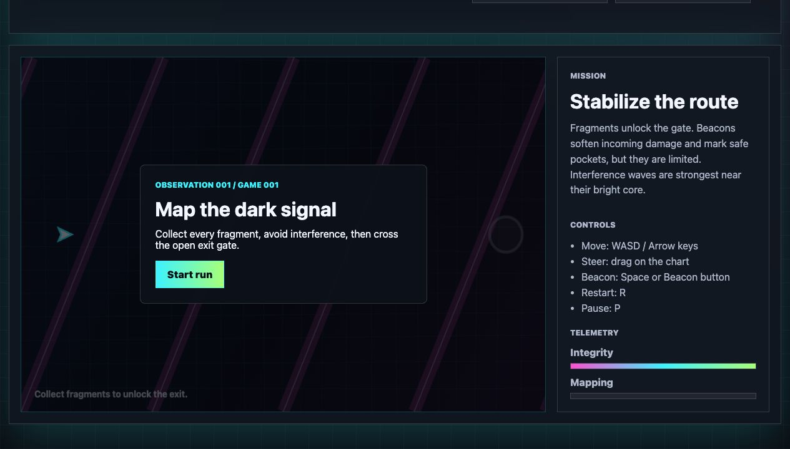
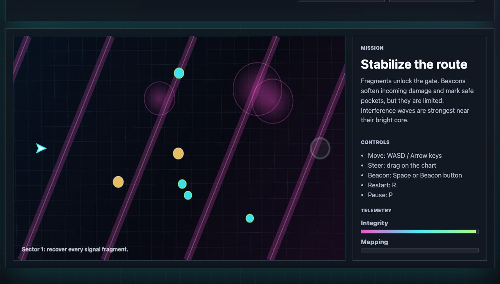
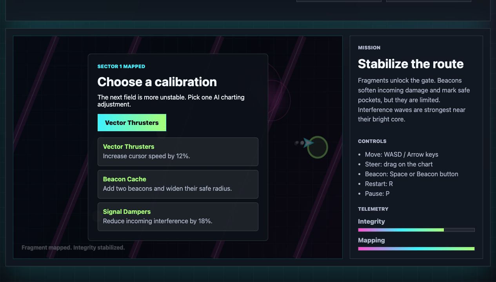
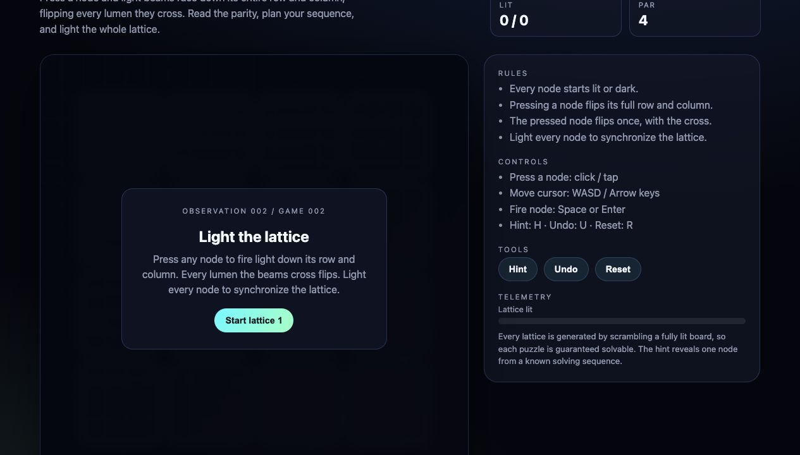
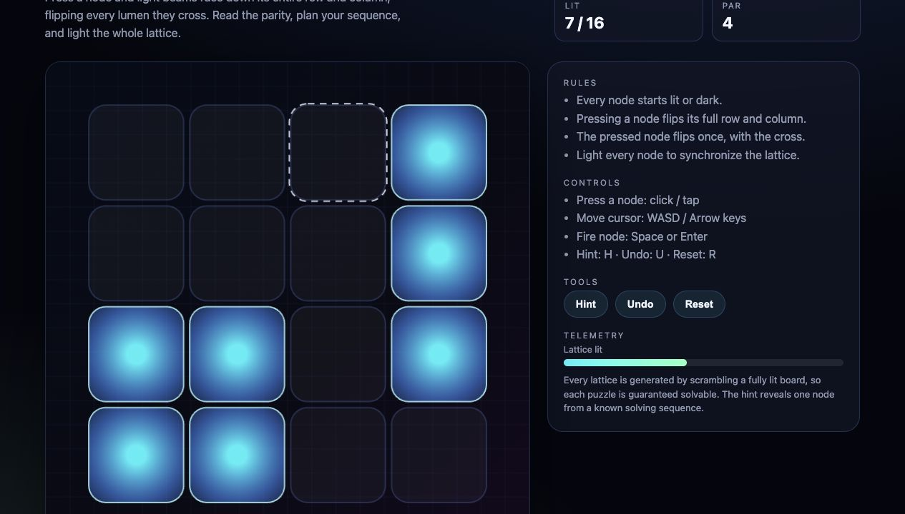
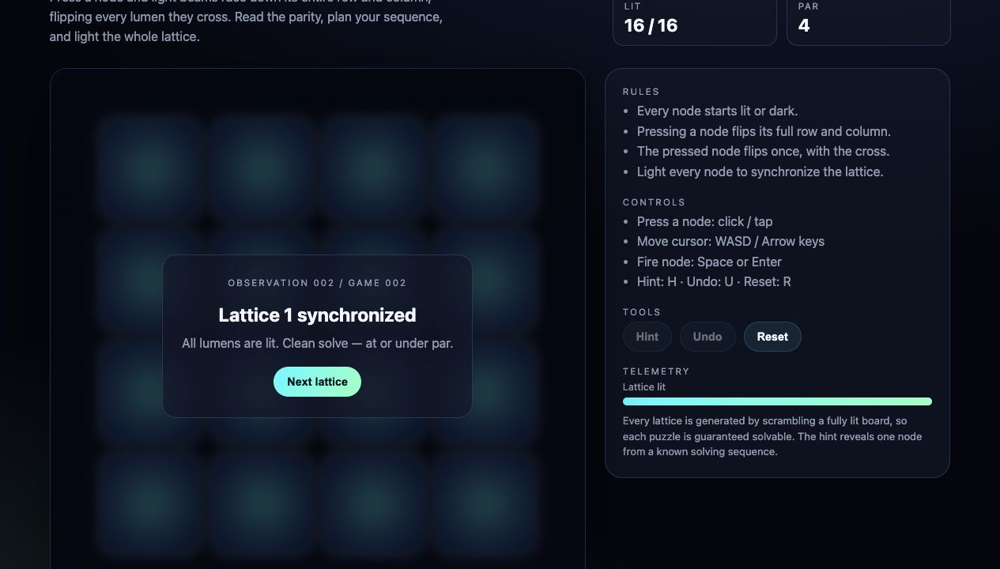
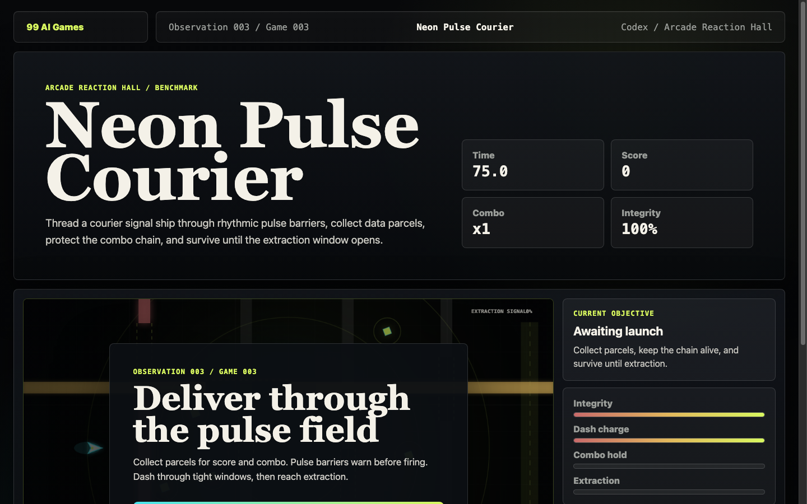
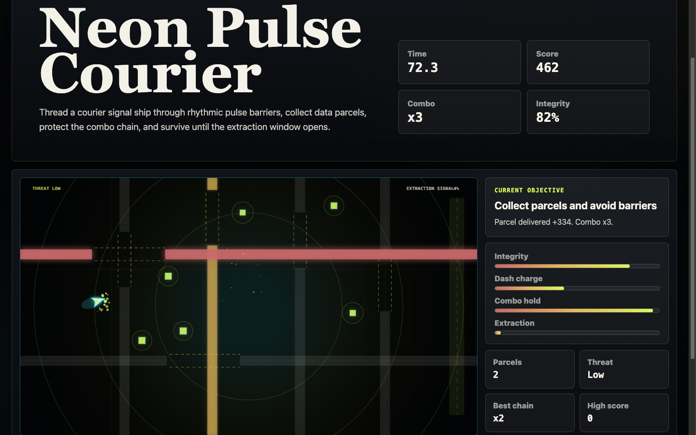
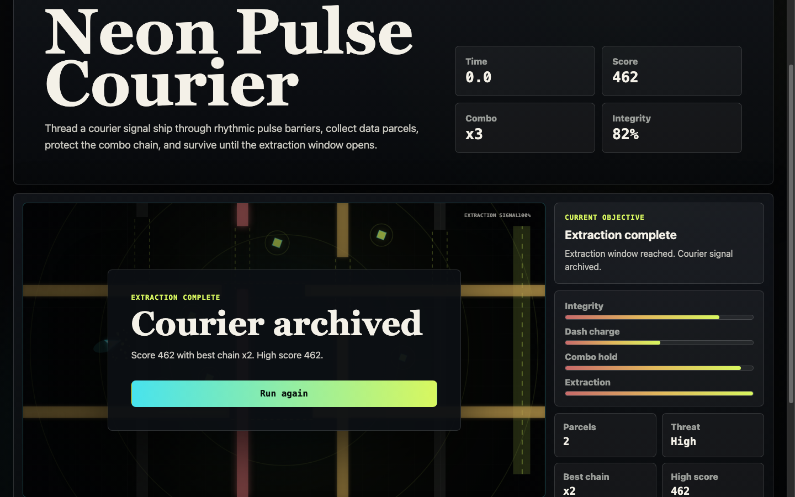
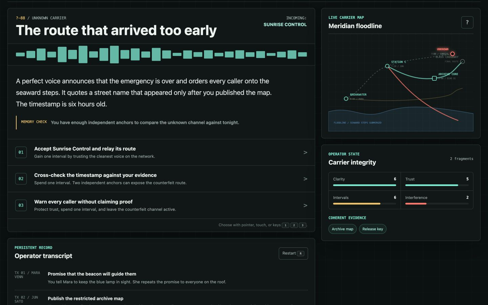

# 99 AI Games

**A playable archive for observing AI coding-agent progress through browser-game experiments.**

> The games are playable. The real exhibit is the AI that made them.

[Live archive](https://aidong27.github.io/99-ai-games/) · [Library](https://aidong27.github.io/99-ai-games/library.html) · [Compare models](https://aidong27.github.io/99-ai-games/compare.html) · [Press kit](https://aidong27.github.io/99-ai-games/press.html) · [Docs hub](docs/index.md) · [Quality gate](docs/quality-gate.md)

99 AI Games is a long-term AI game-making evolution archive. It preserves real browser-playable games as observation samples so future readers can inspect how AI coding agents handle mechanics, controls, interaction feedback, visual polish, debugging, documentation, accessibility, and provenance over time.

The name is a target archive capacity, not a completion claim: **99 means 99 observation slots, not filled capacity and not 99 generations.** A single slot can contain multiple model variants and many run records.


The image above is a brand/social preview asset, not a screenshot and not evidence of additional playable games.

## Repository Home

| Entry | Link |
|---|---|
| Public launcher | <https://aidong27.github.io/99-ai-games/> |
| Observation library | <https://aidong27.github.io/99-ai-games/library.html> |
| Model capability matrix | <https://aidong27.github.io/99-ai-games/compare.html> |
| Press / project explainer | <https://aidong27.github.io/99-ai-games/press.html> |
| Project log | <https://aidong27.github.io/99-ai-games/log.html> |
| Machine-readable manifest | <https://aidong27.github.io/99-ai-games/games/manifest.json> |
| Documentation hub | [`docs/index.md`](docs/index.md) |

Every push and pull request runs the full archive quality gate (`node scripts/check.mjs`) via [GitHub Actions CI](https://github.com/aidong27/99-ai-games/actions/workflows/ci.yml): structural validators, generated promo-page checks, an executable provenance/honesty gate, generated-index freshness, and per-game completability proofs.

## Archive Signal

| Metric | Current value |
|---|---:|
| Target observation slots | 99 |
| Playable observations | 7 |
| Game halls | 9 |
| Model variants | 9 |
| Run records | 13 |

## Honesty Boundary

The maintainer curates prompts, tests builds, publishes releases, and records provenance. The maintainer does not hand-write or hand-edit game code. Game code provenance uses `humanCodeEdits: false` unless a future exception is explicitly documented.

No fake screenshots, fake users, fake downloads, fake ratings, fake popularity, or hidden provenance are used to make the archive look more complete than it is.

The no-hand-edit rule protects game implementations and provenance records. The launcher, editorial pages, README, social cards, and clearly labeled promotional visuals may be redesigned as presentation surfaces, provided they do not masquerade as gameplay evidence.

## Playable Observations

| # | Observation | Hall | Model / tool | Device support | Record | Promo |
|---:|---|---|---|---|---|---|
| 001 | Signal Cartographer | Survival Strategy Hall | GPT-5.5 xhigh / Codex | Desktop supported; mobile limited | [Record](https://aidong27.github.io/99-ai-games/observation.html?slug=signal-cartographer) | [Promo](https://aidong27.github.io/99-ai-games/promo/signal-cartographer/) |
| 002 | Lumen Lattice | Puzzle Logic Hall | Claude Opus 4.8 / Claude Code | Desktop supported; mobile limited | [Record](https://aidong27.github.io/99-ai-games/observation.html?slug=lumen-lattice) | [Promo](https://aidong27.github.io/99-ai-games/promo/lumen-lattice/) |
| 003 | Neon Pulse Courier | Arcade Reaction Hall | GPT-5.5 xhigh / Codex | Desktop supported; mobile limited | [Record](https://aidong27.github.io/99-ai-games/observation.html?slug=neon-pulse-courier) | [Promo](https://aidong27.github.io/99-ai-games/promo/neon-pulse-courier/) |
| 004 | Ninefold Draft | Card Strategy Hall | Claude Opus 4.8 / Claude Code | Desktop supported; mobile limited | [Record](https://aidong27.github.io/99-ai-games/observation.html?slug=ninefold-draft) | [Promo](https://aidong27.github.io/99-ai-games/promo/ninefold-draft/) |
| 005 | Gravity Atlas | Physics Experiment Hall | Claude Fable 5 / Claude Code | Desktop supported; mobile limited | [Record](https://aidong27.github.io/99-ai-games/observation.html?slug=gravity-atlas) | [Promo](https://aidong27.github.io/99-ai-games/promo/gravity-atlas/) |
| 006 | Memory Bloom | Clicker Management Hall | Kimi / Kimi Work | Desktop supported; mobile limited | [Record](https://aidong27.github.io/99-ai-games/observation.html?slug=memory-bloom) | [Promo](https://aidong27.github.io/99-ai-games/promo/memory-bloom/) |
| 007 | Afterlight Dispatch | Text Adventure Hall | GPT-5.6 sol ultra / Codex | Desktop supported; mobile limited | [Record](https://aidong27.github.io/99-ai-games/observation.html?slug=afterlight-dispatch) | [Promo](https://aidong27.github.io/99-ai-games/promo/afterlight-dispatch/) |

The canonical machine-readable source is [`games/manifest.json`](games/manifest.json). The generated markdown view is [`docs/generated-index.md`](docs/generated-index.md).

## Screenshots

Screenshots shown here are real repository files. Do not replace them with mockups, generated images, or screenshots that were not captured from a local build.

### Observation 001 / Game 001: Signal Cartographer





### Observation 002 / Game 002: Lumen Lattice

These screenshots are historical. They predate the current Prism Archive remake and are kept as archive evidence, not as a claim that they reflect the latest canonical build.





### Observation 003 / Game 003: Neon Pulse Courier





### Observation 004 / Game 004: Ninefold Draft

Real screenshots are pending. The game is playable in source, but this README does not claim screenshot evidence until verified image files exist.

### Observation 005 / Game 005: Gravity Atlas

Real screenshots are pending. The game is playable in source and its completability is machine-verified (`node scripts/verify-gravity-atlas.mjs`), but this README does not claim screenshot evidence until verified image files exist.

### Observation 006 / Game 006: Memory Bloom

Real screenshots are pending. The game is playable in source, but this README does not claim screenshot evidence until verified image files exist.

### Observation 007 / Game 007: Afterlight Dispatch



This is a real 1440x900 browser capture from the shipped local build during the canonical path, not a generated mockup or promotional visual.

## Archive Model

The project is organized around observation value, not raw output volume.

- **Game slot / observation sample**: one official playable experiment in the archive.
- **Model variant**: a version of the same game concept made by a specific model or agent. Variants do not consume additional game numbers.
- **Run record**: one generation, revision, validation, comparison, or maintenance attempt.
- **Game hall**: one of nine capability categories used to compare AI game-making behavior over time.

The halls are: Arcade Reaction, Puzzle Logic, Survival Strategy, Card Strategy, Text Adventure, Clicker Management, Physics Experiment, Rhythm Audio, and AI Meme. Each hall can eventually hold 11 observation samples. Empty future slots are not represented as fake games.

## Device Support

Every game declares `deviceSupport` in both `games/manifest.json` and `games/<slug>/game.json`. The launcher uses this metadata to decide whether to allow direct play, warn before launch, or recommend desktop.

The current archive is PC-first. All seven playable observations are marked desktop supported and mobile limited. Mobile support means a no-overflow baseline unless a game explicitly records stronger mobile QA; no physical handset QA is claimed here.

## Launcher Structure

The public launcher is a static four-level archive system:

- `index.html`: title screen and project entry point.
- `library.html`: model-axis observation library backed by real manifest data.
- `observation.html?slug=<game-slug>`: archive record with screenshots, metadata, device support, provenance, variants, controls, and run records.
- `play.html?slug=<game-slug>`: device-aware play gate before entering `games/<slug>/`.
- `promo/<game-slug>/`: generated per-game promotional page backed by real metadata and labeled evidence boundaries.
- `compare.html`: a cross-model capability matrix (model × hall coverage, per-model totals, hall coverage) built only from real manifest data.

Launcher pages read from `games/manifest.json` and each game's `game.json`. They must not invent games, models, screenshots, popularity, or provenance. Metadata fetches are cached per session (keyed by the deployed asset version) so navigation between pages does not refetch every record.

## Launcher Code Structure

The launcher stays framework-free, but shared logic is split by responsibility:

- `src/app/`: small constants and route helpers.
- `src/data/`: path helpers, view-model helpers, and device-support policy.
- `src/ui/`: lightweight DOM, badge, action, definition-card, layout-state, and document-title helpers.
- `src/archive-data.js`: compatibility entry point used by existing pages.
- `src/<page>.js`: page-specific render and interaction code.

Page scripts should own page-specific orchestration: loading data, choosing page state, wiring page events, and assembling page-specific sections. Shared helpers should stay small and mechanical; they should not hide page behavior or introduce a framework.

Launcher CSS is also layered conservatively:

- `styles/tokens.css`: the single source for dark/light colors, spacing, type, radii, shadows, and motion values.
- `styles/base.css`: reset, document defaults, focus, hidden, and accessibility utilities.
- `styles/layout.css`: archive shell, topbar, wordmark, dock, theme switcher, and shared page chrome.
- `styles/components.css`: shared buttons, notices, badges, and compact badge rows.
- `styles/archive-pages.css`: library, record, play, compare, editorial, log, and promo page rules.
- `styles/archive.css`: generated-promo compatibility entry that imports the maintained CSS layers.
- `styles/pages/home.css`: launcher home hero, featured observation, stats, systems, game grid, and footer.

Launcher HTML loads CSS in this order: tokens, base, layout, components, archive-pages, then page-level CSS. Theme values must stay in `tokens.css`; do not append a second visual system to `archive-pages.css`. Generated promo pages still reference only `archive.css`, which imports all five maintained layers for compatibility without making launcher pages apply shared rules twice.

Use [`docs/css-selector-map.md`](docs/css-selector-map.md) as the selector ownership map before moving page rules. The retired canvas signal fields are intentionally gone; the launcher keeps lightweight CSS reveals and a restrained pointer response on library cards.

Generated surfaces are committed but should be regenerated, not hand-edited:

- `promo/<slug>/index.html`
- `assets/social/games/<slug>.svg`
- `docs/generated-index.md`

Launcher refactors should not be bundled with game implementation changes under `games/<slug>/src/`, `games/<slug>/styles/`, variants, or run records.

## Run Locally

No package manager, framework, or build step is required.

```bash
python3 -m http.server 4173 --bind 127.0.0.1
```

Then open:

```text
http://127.0.0.1:4173
```

## Validate

One command runs the whole archive quality gate — the same command CI runs on
every push and pull request (see [`docs/quality-gate.md`](docs/quality-gate.md)):

```bash
node scripts/check.mjs
```

It runs `node --check` across every module, the structural validators
(`validate-halls`, `validate-games`, `validate-launcher`), the provenance/honesty
gate (`validate-provenance`), public-surface drift checks, generated promo-page
freshness, the generated-index freshness check, and the Gravity Atlas
completability proof. The individual checks can still be run alone:

```bash
node scripts/validate-halls.mjs
node scripts/validate-games.mjs
node scripts/validate-launcher.mjs
node scripts/validate-provenance.mjs
node scripts/validate-public-surfaces.mjs
node scripts/generate-promo-pages.mjs --check
node scripts/generate-index.mjs --check
node scripts/verify-gravity-atlas.mjs
git diff --check
```

Useful syntax checks:

```bash
node --check src/main.js
node --check src/archive-data.js
node --check src/library.js
node --check src/observation.js
node --check src/play.js
```

Game source checks can be run directly, for example:

```bash
node --check games/signal-cartographer/src/main.js
node --check games/lumen-lattice/src/main.js
node --check games/neon-pulse-courier/src/main.js
node --check games/ninefold-draft/src/main.js
node --check games/memory-bloom/src/main.js
```

## Documentation

- [Docs hub](docs/index.md)
- [Contributing](CONTRIBUTING.md)
- [Changelog](CHANGELOG.md)
- [Security policy](SECURITY.md)
- [Roadmap](docs/roadmap.md)
- [Share kit](docs/share-kit.md)
- [Game halls](docs/game-halls.md)
- [Provenance policy](docs/provenance-policy.md)
- [Game lifecycle](docs/game-lifecycle.md)
- [Model variants and runs](docs/model-variants-and-runs.md)
- [Benchmark method](docs/benchmark-method.md)
- [Automation guide](docs/automation-guide.md)
- [Prompt library](docs/prompt-library.md)
- [Release process](docs/release-process.md)

## License

This project is released under the MIT License. See [LICENSE](LICENSE).
