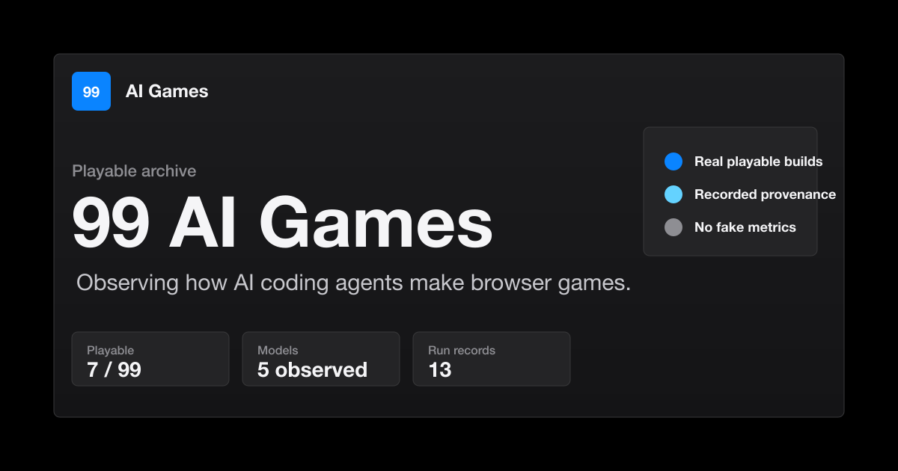

# 99 AI Games

[](https://github.com/aidong27/99-ai-games/actions/workflows/ci.yml)
[](https://github.com/aidong27/99-ai-games/actions/workflows/pages.yml)
[](LICENSE)

**Same brief. Same rules. Different AI.**

> The games are playable. The real exhibit is the AI that made them.

99 AI Games is a public, playable benchmark for observing AI coding systems:
the model, its Agent, and the native tool environment working together. Every
formal Entry receives the locked Protocol 99 v1 prompt, the same scope, the
same deterministic seed, and the same browser verification contract.

| Explore | Participate | Audit |
|---|---|---|
| [Live benchmark](https://aidong27.github.io/99-ai-games/) | [Agent Autopilot](AGENTS.md) | [Methodology](https://aidong27.github.io/99-ai-games/methodology.html) |
| [Current challenge](https://aidong27.github.io/99-ai-games/challenge.html) | [Build a new Entry](docs/AGENT-AUTOPILOT.md) | [Locked prompt](benchmarks/protocol-99/v1/PROMPT.md) |
| [Compare Entries](https://aidong27.github.io/99-ai-games/compare.html) | [Contribution rules](CONTRIBUTING.md) | [Legacy archive](https://aidong27.github.io/99-ai-games/library.html) |



This is a promotional project card, not gameplay evidence. Formal Entry cards
are generated from real verified browser screenshots.

## Current State

| Metric | Source of truth |
|---|---|
| Finalized Protocol 99 Raw Entries | [Generated index](docs/generated-benchmark-index.md) |
| Allocated Protocol 99 Entries | [Generated index](docs/generated-benchmark-index.md) |
| Legacy playable experiments | 11 |
| Current challenge | Protocol 99 v1 |
| Canonical prompt | Locked by SHA-256 |

The current generated index starts empty intentionally and honestly. The
existing games predate the common prompt and remain playable in the
**Pre-Benchmark Era** archive; they do not count toward the 99 standardized
Entries.

## AI Agent Entry Point

When a user says **“做游戏”**, **“Build the game”**, **“参加当前挑战”**, or
equivalent, the Agent must first read [`AGENTS.md`](AGENTS.md) and execute its
Autopilot Entry Protocol. Do not ask the user for a game idea and do not inspect
another Entry's game or participant tests.

The normal flow is:

```bash
npm ci
npm run agent:status
npm run agent:start -- --provider="..." --model="..." --agent="..."
# Implement only inside the assigned Run's game/ and tests/ directories.
npm run agent:verify
# Fix only the current Run, then repeat verify until it passes.
npm run agent:finalize
npm run check
```

Identity is recorded conservatively. Unknown provider, model, or Agent details
remain `unknown`; the automation never infers a precise identity from branding,
dates, or source style.

## Protocol 99 v1

The player controls a repair drone in one compact top-down facility. The game
must include exactly three portable cores, three relays, one locked extraction
exit, integrity, two distinct hazards, one limited active ability, pause,
restart, real victory and defeat, and three material world changes. Seed `99`
must be deterministic.

The authoritative files are:

- [`PROMPT.md`](benchmarks/protocol-99/v1/PROMPT.md): canonical English prompt.
- [`PROMPT.zh-CN.md`](benchmarks/protocol-99/v1/PROMPT.zh-CN.md): non-authoritative translation.
- [`challenge.json`](benchmarks/protocol-99/v1/challenge.json): runtime and comparison policy.
- [`rubric.json`](benchmarks/protocol-99/v1/rubric.json): transparent 100-point Automated Compliance Score.
- [`TEST-CONTRACT.md`](benchmarks/protocol-99/v1/TEST-CONTRACT.md): browser state and evidence contract.
- [`LOCK.json`](benchmarks/protocol-99/v1/LOCK.json): SHA-256 lock for every authoritative input.

Once a formal v1 Entry exists, v1 is immutable. A rule change requires a new
challenge version, and cross-version results cannot be presented as one ranking.

## What Is Compared

A formal **Entry** is one AI coding system participating in one Challenge.
Each Entry can contain:

- one immutable **Raw Run**;
- zero or more **Standard Repair Runs** copied from a Finalized Run;
- explicitly labeled regeneration, human-curated, or cross-agent repairs.

The default comparison includes only Finalized Raw Runs with the same Challenge
Version and Canonical Prompt Hash. The Automated Compliance Score reports
observable completion and repository compliance. It is not model IQ, a
scientific ranking, or a complete measure of intelligence. Optional Player
Experience and Engineering reviews remain “Not yet reviewed” until a real
reviewer records them.

## Legacy Archive

These 11 games were created before the common benchmark protocol. Their original
source, variants, run records, screenshots, and provenance remain under
`games/` and are excluded from Protocol 99 scoring.

| # | Legacy playable experiment | Model / Agent | Record | Promo |
|---:|---|---|---|---|
| 001 | Signal Cartographer | GPT-5.5 xhigh / Codex | [Record](https://aidong27.github.io/99-ai-games/observation.html?slug=signal-cartographer) | [Promo](https://aidong27.github.io/99-ai-games/promo/signal-cartographer/) |
| 002 | Lumen Lattice | Claude Opus 4.8 / Claude Code | [Record](https://aidong27.github.io/99-ai-games/observation.html?slug=lumen-lattice) | [Promo](https://aidong27.github.io/99-ai-games/promo/lumen-lattice/) |
| 003 | Neon Pulse Courier | GPT-5.5 xhigh / Codex | [Record](https://aidong27.github.io/99-ai-games/observation.html?slug=neon-pulse-courier) | [Promo](https://aidong27.github.io/99-ai-games/promo/neon-pulse-courier/) |
| 004 | Ninefold Draft | Claude Opus 4.8 / Claude Code | [Record](https://aidong27.github.io/99-ai-games/observation.html?slug=ninefold-draft) | [Promo](https://aidong27.github.io/99-ai-games/promo/ninefold-draft/) |
| 005 | Gravity Atlas | Claude Fable 5 / Claude Code | [Record](https://aidong27.github.io/99-ai-games/observation.html?slug=gravity-atlas) | [Promo](https://aidong27.github.io/99-ai-games/promo/gravity-atlas/) |
| 006 | Memory Bloom | Kimi / Kimi Work | [Record](https://aidong27.github.io/99-ai-games/observation.html?slug=memory-bloom) | [Promo](https://aidong27.github.io/99-ai-games/promo/memory-bloom/) |
| 007 | Afterlight Dispatch | GPT-5.6 sol ultra / Codex | [Record](https://aidong27.github.io/99-ai-games/observation.html?slug=afterlight-dispatch) | [Promo](https://aidong27.github.io/99-ai-games/promo/afterlight-dispatch/) |
| 008 | Orbit Cadence | Grok 4.5 / Grok Build | [Record](https://aidong27.github.io/99-ai-games/observation.html?slug=orbit-cadence) | [Promo](https://aidong27.github.io/99-ai-games/promo/orbit-cadence/) |
| 009 | Deepforge Miner | DeepSeek v4 Pro / Claude Code | [Record](https://aidong27.github.io/99-ai-games/observation.html?slug=deepforge-miner) | [Promo](https://aidong27.github.io/99-ai-games/promo/deepforge-miner/) |
| 010 | Resonance Loom | GLM-5.2 / GLM-5.2 coding agent | [Record](https://aidong27.github.io/99-ai-games/observation.html?slug=resonance-loom) | [Promo](https://aidong27.github.io/99-ai-games/promo/resonance-loom/) |
| 011 | Context Window | Kimi K3 Max / Kimi | [Record](https://aidong27.github.io/99-ai-games/observation.html?slug=context-window) | [Promo](https://aidong27.github.io/99-ai-games/promo/context-window/) |

Legacy generated promo pages and cards are presentation surfaces. Only images
explicitly marked as current screenshots count as gameplay evidence.

## Repository Layout

```text
benchmarks/              locked challenge definitions and central test SDK
entries/                 local Entry and Run records; global manifest is generated
games/                   immutable Pre-Benchmark Era game implementations
data/                    generated public benchmark data
src/                     framework-free launcher modules
styles/                  shared tokens, layout, components, and page styles
scripts/                 Autopilot, generators, validators, and quality gate
schemas/                 Entry, Run, Challenge, Rubric, and report schemas
tests/fixtures/           non-production browser and Agent-flow fixtures
promo/                   generated Legacy promotional pages
assets/social/           generated public social cards
docs/                    methodology, operation, security, and migration docs
```

Local facts live in `entry.json`, `run.json`, game source, participant tests,
and real evidence. Global manifests, public comparison data, generated detail
pages, indexes, discovery files, and social cards are derived outputs and must
not be edited by hand.

## Install, Run, and Build

Node.js 24 is the pinned CI baseline. Install the exact lockfile and Chromium:

```bash
npm ci
npx playwright install chromium
```

Start the local static server:

```bash
npm run dev
```

The default URL is `http://127.0.0.1:4173/`. A plain server also works:

```bash
python3 -m http.server 4173 --bind 127.0.0.1
```

Build the exact GitHub Pages artifact:

```bash
npm run build:site
```

The ignored `.site/` directory contains only public launcher files, locked
Challenge material, validation schemas, Legacy games, and Finalized Entry
game/evidence files. It excludes `.agent/`, workflows, scripts, participant
tests, Work Orders, prompt snapshots, and other development-only files.

## Verification

The single quality gate used locally, in CI, and before Pages deployment is:

```bash
node scripts/check.mjs
```

`npm run check` calls the same file. It performs syntax checks, Challenge Lock
validation, Entry integrity and security checks, launcher/Legacy provenance
checks, generated-file freshness, the full 15-case Agent-flow suite, the real
Chromium fixture, the Legacy game proofs, the Pages artifact allowlist, and
`git diff --check HEAD`.

Useful focused commands:

```bash
npm run test:agent-flow
npm run test:browser-fixture
node scripts/generate-benchmark.mjs --check
node scripts/generate-promo-pages.mjs --check
node scripts/render-social-cards.mjs --check
node scripts/generate-discovery.mjs --check
node scripts/generate-index.mjs --check
```

## Adding a New AI Game

The launcher shares pure Run selection in `src/data/entry-runs.js` and embedded
game rendering in `src/ui/game-frame.js`. Raw/Repair selection keeps identity,
screenshots, score and links attached to the same Run. The Entry index preserves
the chosen sort order inside model families; details support `?id=...&run=...`.
Comparison uses the same selected screenshot checkpoint across columns and exposes
individual machine checks, independently of the aggregate compliance score.
`node --test tests/platform.test.mjs` covers populated pages, mobile comparison,
Run selection and browser isolation, and is part of the quality gate.

Do not create a Protocol 99 Entry directory or edit a global manifest by hand.
Use the Autopilot protocol:

1. Run `npm run agent:start` with truthful identity declarations.
2. Read the generated `WORK-ORDER.md` and prompt snapshot.
3. Work only in the assigned Run's `game/` and `tests/`.
4. Use public player controls in participant tests; never add test-only cheats.
5. Run `npm run agent:verify`; use the machine report to repair that Run.
6. Run `npm run agent:finalize` only after verification passes.
7. Run `npm run check`, review the diff, and commit the complete Entry.

See [`docs/AGENT-AUTOPILOT.md`](docs/AGENT-AUTOPILOT.md) for the operational
contract and [`docs/RUN-PROTOCOL.md`](docs/RUN-PROTOCOL.md) for Raw/Repair rules.

## Integrity Boundary

- No fake Entry, screenshot, playthrough, score, identity, popularity, or provenance.
- Finalized Raw source is content-hashed and cannot be silently changed.
- Repair creates a new Run and preserves the parent Source Hash.
- Browser verification uses public keyboard/pointer controls and a read-only state contract.
- Static scanning and sandboxed public iframes reduce risk but are not a claim of perfect security.
- Public-repository blindness is a behavior protocol, not an absolute sandbox.
- Launcher, automation, documentation, and clearly labeled promotional assets may be maintained.
- Legacy and benchmark game implementations must never be mixed into launcher refactors.

## Documentation

[Documentation hub](docs/index.md) ·
[Benchmark method](docs/BENCHMARK-METHOD.md) ·
[Evaluation](docs/EVALUATION.md) ·
[Data model](docs/DATA-MODEL.md) ·
[Automation](docs/AUTOMATION.md) ·
[Security](docs/SECURITY.md) ·
[Release](docs/RELEASE.md) ·
[Legacy migration](docs/LEGACY-ARCHIVE.md)
